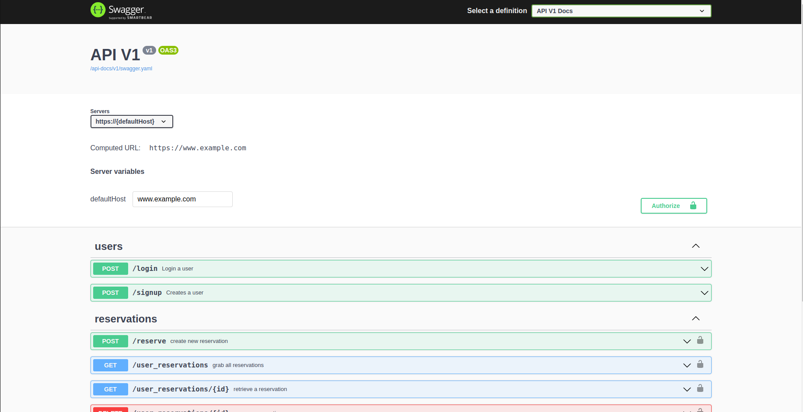

# Tour Booking App (backend)

> This is an app in which you can reserve a tour, create a tour, delete a tour and show all your reserved tours. This app was created by separating the Fron-End and the Back-End into two repositories.
> 

## API documentation

<!-- - https://booking-tour-app.herokuapp.com/api-docs/index.html -->

- https://tour-booking.onrender.com//api-docs/index.html

## Kanban Board

1- [Link to Kanban Board.](https://github.com/NatiDeme/tour-booking-backend/projects/1)

 
 
## [Link to FRONT END REPOSITORY](https://github.com/ABDULALI3468/bookMe-frontend)

## Built With

- Ruby on Rails
- Postgres

## Setup

If you wish to run the project locally, please do the following:

- Clone the repository to your local machine. - **`git clone hhttps://github.com/NatiDeme/tour-booking-backend`** - **`cd tour-booking-backend`**

### Running the app

- Run `rake db:create:all` and `rake db:migrate`
- Run `rake db:seed` to populate the database with some sample data.
- Run `rails s` to start the server.
- In your browser, go to http://localhost:3000.

### Running test

- Run `rails db:migrate RAILS_ENV=test` to migrate on test database
- Run `rake rswag` to run the test

# Number of Team Mates:-

This project was build with 2 teams Backend and Front End. Our team constitutes of 4 participants. The following are the list of Authors differentiated as worked in teams and their roles.

## Authors

### BACK END TEAM:

👤 **Natnael Demelash (TEAM LEADER) **

- GitHub: [@githubhandle](https://github.com/NatiDeme)
- LinkedIn: [LinkedIn](https://www.linkedin.com/in/natnael-demelash/)

👤 **Taiwo Damola Adediran**

- GitHub: [@githubhandle](https://github.com/tylher)
- LinkedIn: [LinkedIn](https://www.linkedin.com/in/taiwo-adediran-327654127/)

### FRONT END TEAM:

👤 **ABDUL ALI (TEAM LEADER) **

> - This is My **GitHub**: 
> - This is My **Linkedin**: &nbsp;
> - This is My **Twitter**: &nbsp;

👤 **CHARLOTTE DIVINE**

> - This is My **GitHub**: 
> - This is My **Linkedin**: &nbsp;
> - This is My **Twitter**: &nbsp;

## 🤝 Contributing

Contributions, issues, and feature requests are welcome!

Feel free to check the [issues page](../../issues/).

## Show your support

Give a ⭐️ if you like this project!

## Acknowledgments

- Hat tip to anyone whose code was used
- Inspiration
- etc

## 📝 License

This project is [MIT](./MIT.md) licensed.
